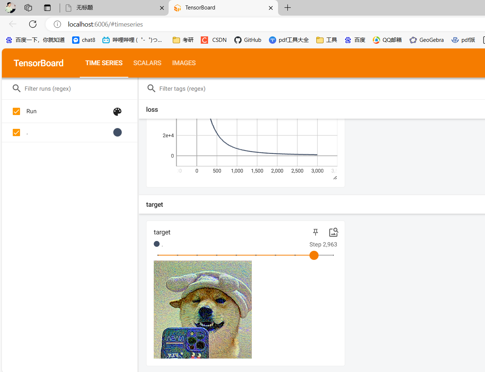
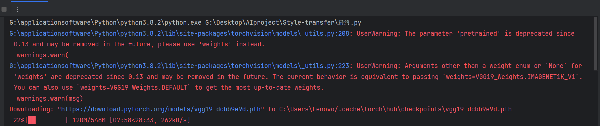
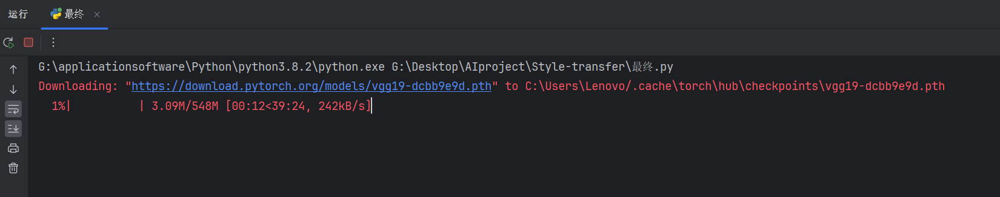
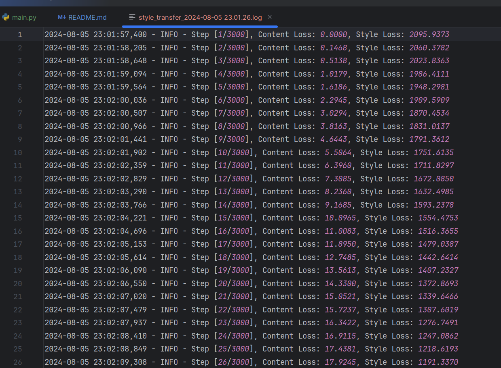
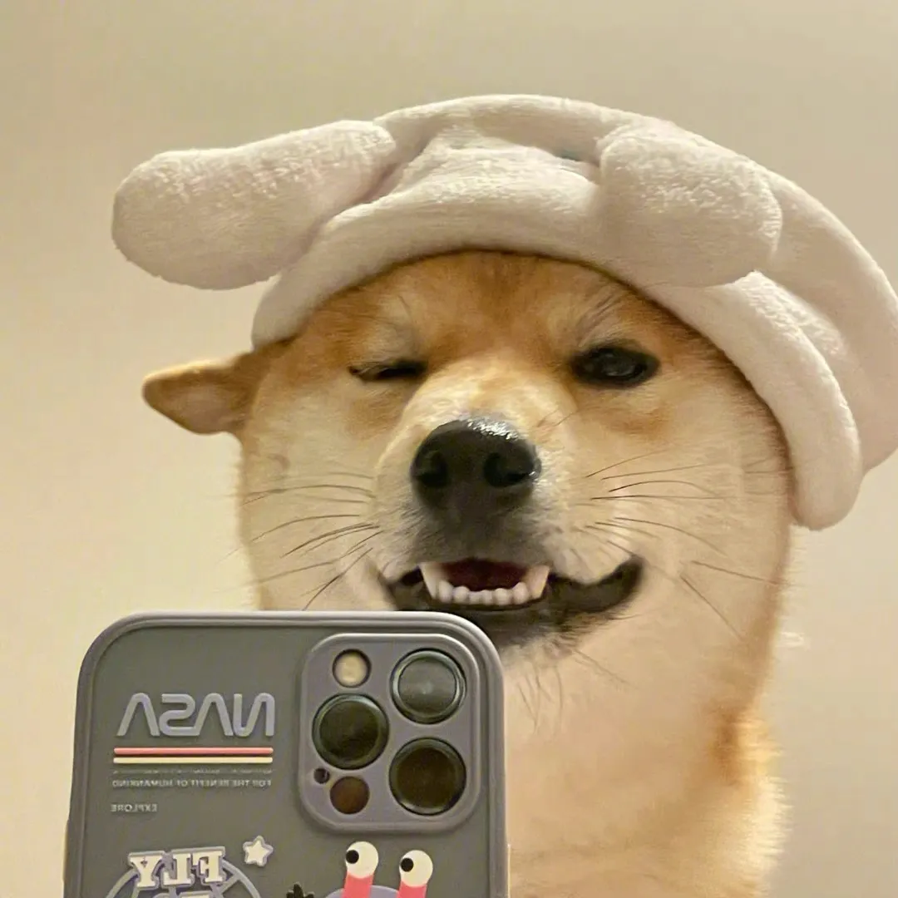
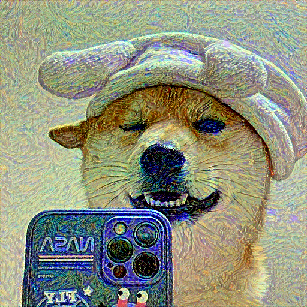

# 前言
由于我不太会pr，所以直接新建的项目，

原项目地址：https://github.com/Optimistism/Style-transfer

原项目代码的讲解地址：https://www.bilibili.com/video/BV1yY4y1c7Cz/

本项目是对原项目的一点点完善。
# 更新
- 2024-08-03 更新：这个项目，是不能保存模型参数的，也就是说，你只能通过训练，得出图片，而不能直接进行推理。
# 项目如何运行
1. 下载项目
这个比较简单，直接在github上下载zip包，然后解压即可。或者使用git clone命令克隆项目。
2. 安装依赖
- 这里由于我没有用到虚拟环境，无法准确得出需要用的包，大致就是torch和我requirements.txt中的包。
- 安装命令
安装torch的话，会比较慢
```shell
pip install -r requirements.txt
```

- 这里需要注意，需要安装tensorboard，作者给出的并没有这个，但是如果没有这个，你是查看不了运行结果的。
3. 运行项目
- 首先就是运行代码
- 然后的话，它会去https://download.pytorch.org/models/vgg19-dcbb9e9d.pth   去下载vgg19的预训练权重，这个文件大概548mb。
由于我这里不知道pytorch如何加载这个文件，因此，**大家可以自己下载这个文件，或者将我这个文件，放到你代码运行后，它给出的那个路径下**。可以看下面我更改部分第一点的第二张图片，运行代码会给出最终下载的路径的。
- 然后想要看到tensorboard中的数据，就在终端输入
```shell
tensorboard --logdir=runs
```
然后点击浏览器，输入localhost:6006
[点击这里也可以](http://localhost:6006/)



后续你跑自己的图片，只需要在`main.py`中修改`content_img`和`style_img`即可。
# 更改
1. 更新了vgg19传参
最开始会报这个警告

使用这行代码后
```shell
# self.vgg = models.vgg19(pretrained=True).features  # .features用于提取卷积层
self.vgg = models.vgg19(weights=VGG19_Weights.IMAGENET1K_V1).features
```
这行代码，会去自动下载官网的vgg19预训练权重，548mb，下载还是很慢的。我下载这个花了30分钟。

我这里由于文件太大，无法上传到github，因此，大家可以自己下载这个文件。

不会警告了


2. 添加了content_weight参数，更加符合其公式要求
```shell
loss = content_weight * content_loss + style_weight * style_loss
```

3. 运行代码后提示报错
```shell
RuntimeError: Input type (torch.FloatTensor) and weight type
 (torch.cuda.FloatTensor) should be the same or input should 
 be a MKLDNN tensor and weight is a dense tensor
```
当模型的权重（weights）和输入数据（inputs）不在同一个设备上时。

这个命令报错表示你的模型权重被移动到了CUDA设备上（即GPU），但是你的输入数据还在CPU上。

因此，具体做法是，将输入数据也移动到device中，它将根据你代码中的变换，自动选择设备。
```shell
# 图片输入到gpu，否则就会报错
content_img = content_img.to(device)
style_img = style_img.to(device)
```
4. **添加了日志记录**

在`main.py`的最开始，添加了一些代码，主要就是设置了日志，并且以时间命名，方便后续将结果保存到日志中，方便查看。免得你自己去创建txt进行cv。



可以看到，这里也会有时间，你可以通过看日志，计算训练的时间。
# 实际体验

我本机是1650的显卡，跑3000轮，花了20分钟。

原图

<div style="text-align:center">
    
</div>
结果图

梵高风的狗头自拍图
<div style="text-align:center">
    
</div>

效果其实还不错


