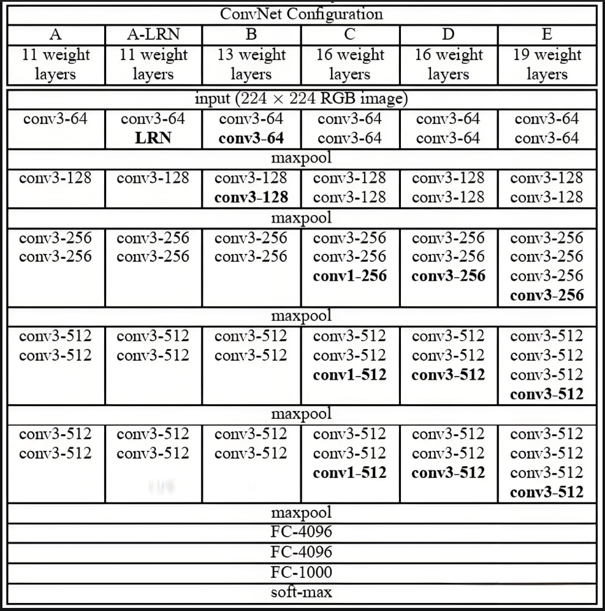
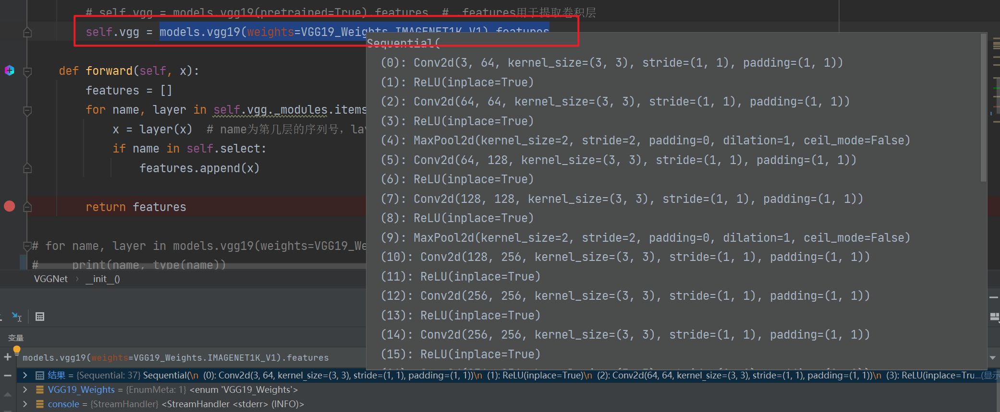
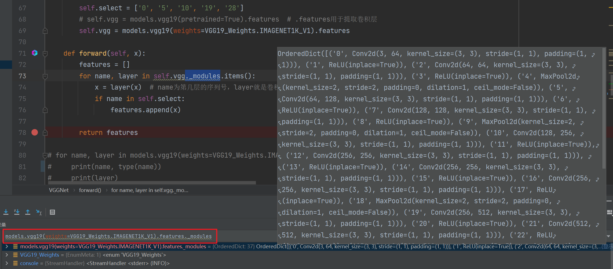
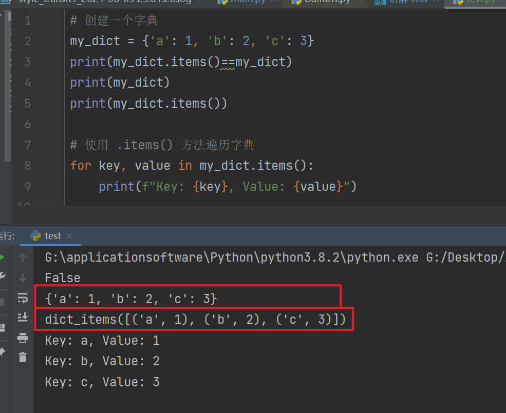
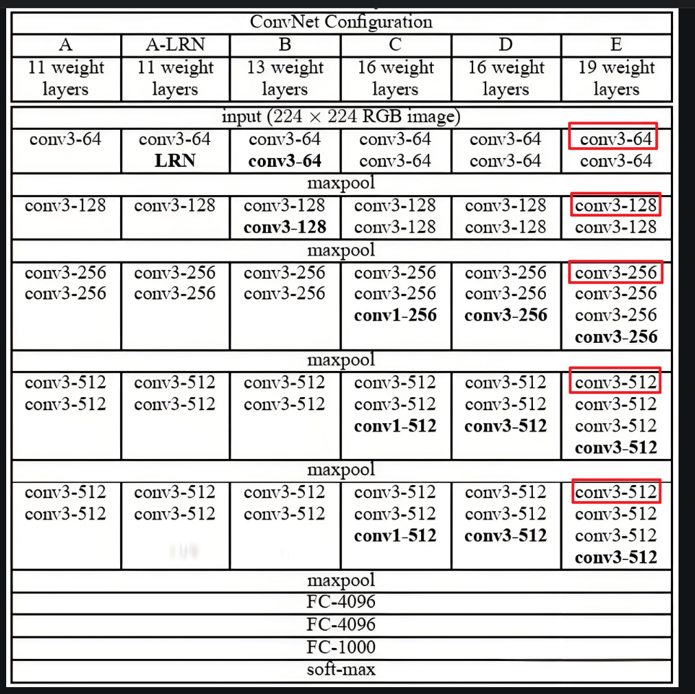

# 番外



```shell
for name, layer in models.vgg19(weights=VGG19_Weights.IMAGENET1K_V1).features._modules.items():
    print(name)
    print(layer)
```
运行结果如下

```shell
0
Conv2d(3, 64, kernel_size=(3, 3), stride=(1, 1), padding=(1, 1))
1
ReLU(inplace=True)
2
Conv2d(64, 64, kernel_size=(3, 3), stride=(1, 1), padding=(1, 1))
3
ReLU(inplace=True)
4
MaxPool2d(kernel_size=2, stride=2, padding=0, dilation=1, ceil_mode=False)
5
Conv2d(64, 128, kernel_size=(3, 3), stride=(1, 1), padding=(1, 1))
6
ReLU(inplace=True)
7
Conv2d(128, 128, kernel_size=(3, 3), stride=(1, 1), padding=(1, 1))
8
ReLU(inplace=True)
9
MaxPool2d(kernel_size=2, stride=2, padding=0, dilation=1, ceil_mode=False)
10
Conv2d(128, 256, kernel_size=(3, 3), stride=(1, 1), padding=(1, 1))
11
ReLU(inplace=True)
12
Conv2d(256, 256, kernel_size=(3, 3), stride=(1, 1), padding=(1, 1))
13
ReLU(inplace=True)
14
Conv2d(256, 256, kernel_size=(3, 3), stride=(1, 1), padding=(1, 1))
15
ReLU(inplace=True)
16
Conv2d(256, 256, kernel_size=(3, 3), stride=(1, 1), padding=(1, 1))
17
ReLU(inplace=True)
18
MaxPool2d(kernel_size=2, stride=2, padding=0, dilation=1, ceil_mode=False)
19
Conv2d(256, 512, kernel_size=(3, 3), stride=(1, 1), padding=(1, 1))
20
ReLU(inplace=True)
21
Conv2d(512, 512, kernel_size=(3, 3), stride=(1, 1), padding=(1, 1))
22
ReLU(inplace=True)
23
Conv2d(512, 512, kernel_size=(3, 3), stride=(1, 1), padding=(1, 1))
24
ReLU(inplace=True)
25
Conv2d(512, 512, kernel_size=(3, 3), stride=(1, 1), padding=(1, 1))
26
ReLU(inplace=True)
27
MaxPool2d(kernel_size=2, stride=2, padding=0, dilation=1, ceil_mode=False)
28
Conv2d(512, 512, kernel_size=(3, 3), stride=(1, 1), padding=(1, 1))
29
ReLU(inplace=True)
30
Conv2d(512, 512, kernel_size=(3, 3), stride=(1, 1), padding=(1, 1))
31
ReLU(inplace=True)
32
Conv2d(512, 512, kernel_size=(3, 3), stride=(1, 1), padding=(1, 1))
33
ReLU(inplace=True)
34
Conv2d(512, 512, kernel_size=(3, 3), stride=(1, 1), padding=(1, 1))
35
ReLU(inplace=True)
36
MaxPool2d(kernel_size=2, stride=2, padding=0, dilation=1, ceil_mode=False)
```

因此，
```python
self.select = ['0', '5', '10', '19', '28']
```
是用来提取VGG19中5个不同卷积层的特征的。

此外，我通过打印type(name)，发现其实际上是str类型的，怪不得select列表中元素是str类型的。

```python
class VGGNet(nn.Module):
    def __init__(self):
        super(VGGNet, self).__init__()
        self.select = ['0', '5', '10', '19', '28']
        # self.vgg = models.vgg19(pretrained=True).features  # .features用于提取卷积层
        self.vgg = models.vgg19(weights=VGG19_Weights.IMAGENET1K_V1).features

    def forward(self, x):
        features = []
        for name, layer in self.vgg._modules.items():
            x = layer(x)  # name为第几层的序列号，layer就是卷积层,,x为输入的图片。x = layer(x)的意思是，x经过layer层卷积后再赋值给x
            if name in self.select:
                features.append(x)

        return features
```




这里将一下`.items()`，下面这个例子就很直观。


当您看到 self.vgg._modules.items() 时，这意味着正在直接访问 self.vgg（即 VGG19 模型的 features 部分）的 _modules 字典，并使用 .items() 方法来遍历它。这样，您就可以同时获得每个子模块的名称（键）和实例（值）。

因此这个前向传播的过程是：
- 首先遍历网络的每一层，将输入量喂入该层，得出输出。并判断刚刚的层是否是vgg19中每一块最开始的卷积层（如下图）

- 如果是的话，且输入数据刚从该卷积层输出，得到了图片的特征，然后将该特征保存到features列表中。
- 如果不是的话，就进入下一层网络，将 这一层网络的输出，作为下一层网络的输入，直到最后。
- for循环结束，返回features列表，此时features中刚好存放了经过卷积层"洗礼"的输出。这里全是关于图片的特征。这个可以去读论文原文。


接下来 ，关键就在于target。如何理解，非常重要。以下是ai的回答：

- target 变量扮演了一个非常重要的角色，它是实现风格迁移（Style Transfer）或内容生成（Content Generation）过程中的一个关键部分。具体来说，target 变量初始化为内容图片（content_img）的一个克隆（clone()），并且设置为需要梯度（requires_grad_(True)）。这个设置允许 PyTorch 的自动求导系统（autograd）在反向传播过程中追踪对 target 所做的修改，并计算这些修改如何影响损失函数（loss function）的值。

- 为什么需要 target？
    1. 作为优化的起点：target 初始化为内容图片，这意味着我们从一个已经具有明确内容的图像开始。**我们的目标是保持这个内容不变（或尽可能少地改变它），同时给这个图像添加新的风格。**因此，target 成为了我们优化的起点。

    2. 可修改性：通过将 target 设置为需要梯度，我们可以使用优化器（如 Adam）来修改 target 的像素值，以最小化内容损失（content loss）和风格损失（style loss）的组合。这个过程会逐步改变 target，使其既保留原始内容图片的内容，又融合风格图片的风格。

    3. 实现风格迁移：风格迁移算法的核心在于找到一个图像，该图像在内容上尽可能接近内容图片，在风格上尽可能接近风格图片。target 就是我们用来达到这个目标的图像，通过不断地优化它来实现风格和内容之间的平衡。

- 训练过程
在训练循环中，您会计算 target 图像经过 VGG 网络后得到的特征（target_features），并与内容图片和风格图片的特征（content_features 和 style_features）进行比较，以计算内容损失和风格损失。然后，这些损失会被用来更新 target 的像素值，以便在下一次迭代中更好地平衡内容和风格。

- 总结
target 是风格迁移算法中的一个关键变量，它代表了我们正在优化的图像。通过将 target 初始化为内容图片的一个克隆，并设置其需要梯度，我们可以使用优化器来修改它的像素值，以最小化内容损失和风格损失的组合，从而实现风格和内容之间的平衡。

